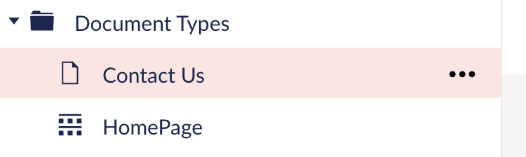
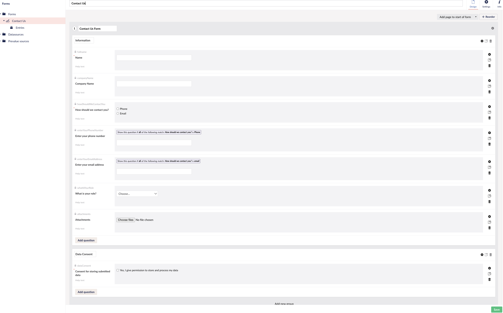
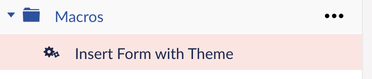
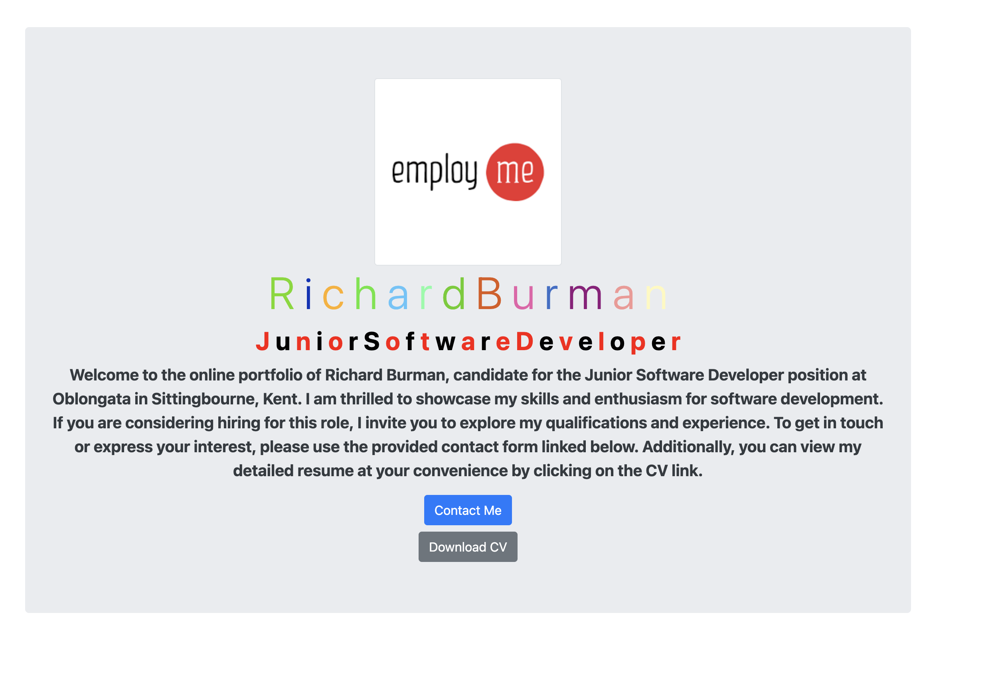
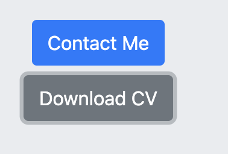
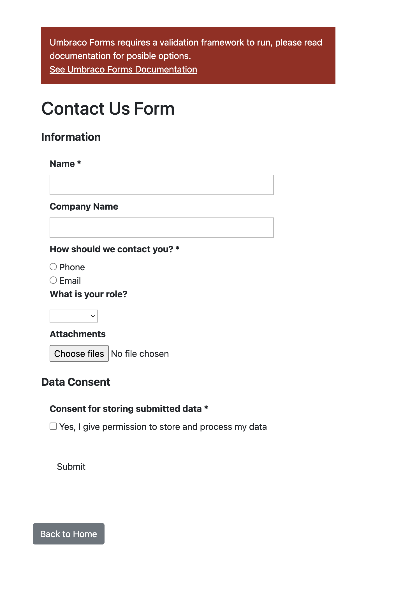
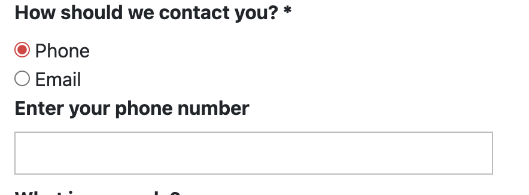
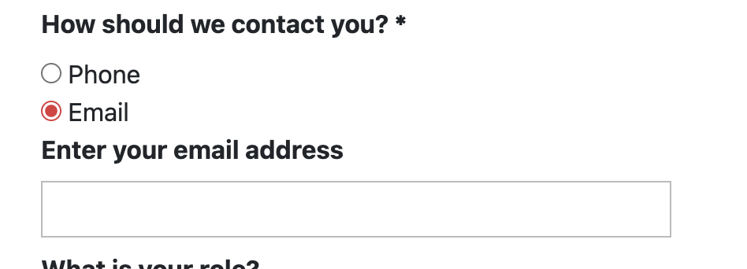
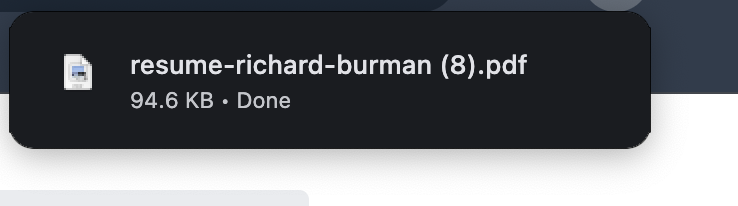

# Umbraco Interview Task

Welcome to my Umbraco project, where I successfully implemented Umbraco for the first time. Following meticulous steps from the Umbraco documentation, I set up Umbraco within VS Code on my MacBook.

## Project Setup

I enriched the Umbraco package by incorporating Umbraco forms and crafted the following document types:

- **HomePage**
- **ContactUs**
  

Additionally, I designed a user-friendly form, the **Contact Us Form**, and integrated it into the Umbraco package.

To enhance the user experience, I created a macro to seamlessly insert the form into the content.

## Content Structure

### HomePage (Landing Page)

The HomePage serves as the primary landing page, featuring:

- **Image**: A responsive image providing users with a clear understanding of the website's purpose.
- **Title (Richard Burman)**: Each character dynamically styled with a random color on every page load.
- **Job Title**: Alternating colors between red and black, aligning with the company colors of Oblongata.
- **Body Text**: A description of the page's content.
- **Links**:
  - **Contact Me**: Directs users to a form expressing interest in employing Richard Burman.
  - **Download CV**: Offers a PDF download of Richard Burman's CV.

### Contact Me Form

This comprehensive form facilitates user data submission, including:

- **Name**
- **Company Name**
- **Preferred Contact Method**:
  - Phone
    
  - Email
    

Upon selecting a contact method, a validation input field dynamically appears, ensuring a seamless user experience.

### CV Download

Allow users to download a PDF copy of Richard Burman's CV.

## Known Bugs/Issues

Despite successful implementation, I encountered challenges styling the form in Umbraco. Default form settings produced a basic design, yet issues persist, such as the unstyled or hidden appearance of the submit button.

